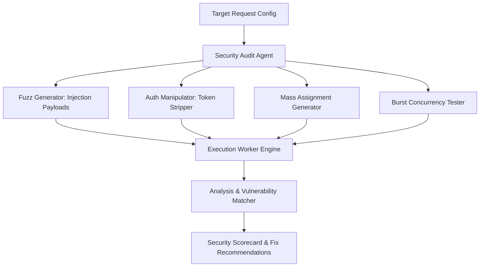
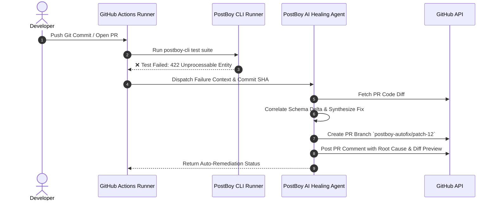

# 🚀 PostBoy: Enterprise-Grade & Unique Feature Implementation Blueprint

> **A Comprehensive Architectural Specification for Next-Generation API Development & Testing**  
> *Target Stack: Next.js 15 (Turbopack, Server Actions), PostgreSQL, Prisma ORM, Better Auth, Tailwind CSS, Monaco Editor, Zustand, TanStack Query, Google Generative AI SDK.*

---

## 📑 Table of Contents

1. [Executive Summary & Product Differentiation](#1-executive-summary--product-differentiation)
2. [Feature 1: Stateful Virtual Mock Server (In-Memory / SQLite State Machine)](#feature-1-stateful-virtual-mock-server)
3. [Feature 2: Autonomous API Security & Fuzzing Red-Team Agent](#feature-2-autonomous-api-security--fuzzing-red-team-agent)
4. [Feature 3: LLM & SSE Streaming Inspector (AI API Profiler)](#feature-3-llm--sse-streaming-inspector)
5. [Feature 4: Built-in Webhook Catcher & Localhost Forwarder](#feature-4-built-in-webhook-catcher--localhost-forwarder)
6. [Feature 5: Natural Language "Flow Orchestrator" (AI Test Chains)](#feature-5-natural-language-flow-orchestrator)
7. [Feature 6: Universal Importer (Swagger 3.1, OpenAPI, Postman v2.1)](#feature-6-universal-importer)
8. [Feature 7: Contract Diffing & Breaking Change Detection](#feature-7-contract-diffing--breaking-change-detection)
9. [Feature 8: Safe-Share Secret Sanitizer & Zero-Leak Redactor](#feature-8-safe-share-secret-sanitizer)
10. [Feature 9: AI "Self-Healing" CI/CD Gatekeeper & PR Auto-Fix Agent (DevOps + AI Agent)](#feature-9-ai-self-healing-cicd-gatekeeper--pr-auto-fix-agent)
11. [Feature 10: Autonomous Chaos Engineering & Canary Traffic Mirroring Agent (DevOps + AI Agent)](#feature-10-autonomous-chaos-engineering--canary-traffic-mirroring-agent)
12. [Database Schema Extensions (Prisma Master Plan)](#12-database-schema-extensions-prisma-master-plan)
13. [Sprint-by-Sprint Implementation Roadmap](#13-sprint-by-sprint-implementation-roadmap)

---

## 1. Executive Summary & Product Differentiation

Current API clients (Postman, Insomnia, Bruno, Hoppscotch) are largely **passive HTTP inspectors**. They allow users to manually send a request, get a response, and write complex JavaScript test assertions.

**PostBoy's Competitive Advantage:**
- **AI-Native & Autonomous:** Instead of forcing developers to write manual assertion code, PostBoy uses AI to fuzz endpoints, heal broken contracts, and simulate stateful backends.
- **Modern Protocol First-Class Support:** Dedicated tooling for LLM token streaming (SSE) and live webhooks without external tunneling dependencies (e.g. ngrok).
- **Privacy & Enterprise-Grade:** Local secret masking, contract diffing, and zero credential leakage.

---

## Feature 1: Stateful Virtual Mock Server

### 1.1 The Problem It Solves
Traditional Postman mock servers return hardcoded, static JSON schemas. If a frontend team calls `POST /api/users`, followed by `GET /api/users`, the new user is **not** present. Developers are forced to wait for backend engineers to finish endpoints or spin up heavy mock database servers (MirageJS, MSW).

### 1.2 How PostBoy Solves It
PostBoy provides **Stateful Dynamic Mocks**:
- Each mock endpoint has an associated dynamic table or JSON store.
- `POST` appends items to the collection.
- `GET /:id` finds the record by ID.
- `PUT / PATCH` updates fields in-place.
- `DELETE` removes items.
- AI can generate initial seed fixtures (e.g., 20 realistic e-commerce products or hospital patients) with 1 click.

### 1.3 Architectural Flow

```
[ Frontend Request ] 
        │
        ▼
[ /api/mock/:workspaceSlug/:resource ] 
        │
        ├── Auth Verification (Optional API key or Public)
        │
        ├── State Engine (Postgres JSONB Store or In-Memory Key-Value)
        │      ├── GET    -> Query & Filter State
        │      ├── POST   -> Validate & Persist State Record
        │      ├── PUT    -> Merge Partial Fields
        │      └── DELETE -> Remove State Record
        │
        ▼
[ Return 200/201 Response with Simulated Latency & Headers ]
```

### 1.4 Database Schema Additions

```prisma
model MockServer {
  id          String   @id @default(cuid())
  workspaceId String
  name        String
  prefix      String   @unique // e.g. "crm-api-v1"
  latencyMs   Int      @default(150) // Simulated latency
  errorRate   Float    @default(0)   // Chaos testing: e.g. 5% 500 errors
  workspace   Workspace @relation(fields: [workspaceId], references: [id], onDelete: Cascade)
  endpoints   MockEndpoint[]
  createdAt   DateTime @default(now())
  updatedAt   DateTime @updatedAt
}

model MockEndpoint {
  id           String      @id @default(cuid())
  mockServerId String
  path         String      // e.g. "/users" or "/users/:id"
  method       HTTP_METHOD // GET, POST, PUT, DELETE, PATCH
  statusCode   Int         @default(200)
  schema       Json        // JSON Schema for validation
  dataStore    Json        // Dynamic state (Array of records)
  mockServer   MockServer  @relation(fields: [mockServerId], references: [id], onDelete: Cascade)
  createdAt    DateTime    @default(now())
  updatedAt    DateTime    @updatedAt

  @@unique([mockServerId, path, method])
}
```

### 1.5 Implementation Steps
1. Create dynamic route handler at `src/app/api/mock/[serverPrefix]/[...path]/route.ts`.
2. Implement routing logic for dynamic path params (e.g., `/users/:id` matching `/users/123`).
3. Handle basic CRUD mutations in `dataStore` JSONB column.
4. Add Mock Server UI tab in the left sidebar with a "Seed with AI" prompt modal.

---

## Feature 2: Autonomous API Security & Fuzzing Red-Team Agent

### 2.1 The Problem It Solves
Developers often ship endpoints vulnerable to **BOLA/IDOR (Broken Object Level Authorization)**, SQL injection, NoSQL operator injection, mass-assignment bugs, and sensitive header leaks because security penetration testing tools (like Burp Suite) are too complex for daily developer workflows.

### 2.2 How PostBoy Solves It
A single button: **"Run Security Audit"** on any request. PostBoy's Red-Team Agent executes an automated multi-vector fuzzing suite and scores the endpoint.

### 2.3 Attack Vectors Tested

| Attack Vector | Test Execution | Success / Failure Flag |
|---|---|---|
| **BOLA / IDOR** | Strips `Authorization` or swaps token with a dummy token | Passes if API returns `401/403`. Fails if `200 OK`. |
| **SQLi / NoSQL Injection** | Injects `' OR '1'='1`, `{"$gt": ""}`, `; DROP TABLE` | Fails if response contains DB error traces (`pg_query`, `syntax error`). |
| **Mass Assignment** | Appends privileged parameters (`isAdmin: true`, `role: "ADMIN"`) | Fails if response body echoes back elevated privileges. |
| **Rate Limit / DoS** | Fires 30 parallel bursts in 500ms | Fails if no `429 Too Many Requests` or throttling kicks in. |
| **Verbose Stack Leak** | Sends malformed payloads / invalid types (`id: true`) | Fails if stack trace / internal file paths are exposed. |

### 2.4 Architecture



### 2.5 Security Audit Result UI Component
- **Badge Rating:** `A+ (Secure)` to `F (Critical Vulnerabilities Found)`.
- **Finding List:** Expandable cards displaying:
  - Exact payload sent.
  - Raw server response.
  - AI-generated remediation code snippet (e.g., "Use Zod `.strict()` to prevent mass-assignment").

---

## Feature 3: LLM & SSE Streaming Inspector

### 3.1 The Problem It Solves
With the explosion of GenAI, developers test endpoints that return `text/event-stream` (Server-Sent Events) from providers like OpenAI, Anthropic, Gemini, and Ollama. Postman and traditional clients buffer the whole stream and dump plain text, giving zero observability into **Time-to-First-Token (TTFT)**, **throughput (Tokens/sec)**, or fragmented JSON SSE boundaries.

### 3.2 Key Capabilities in PostBoy
1. **Live Token Rate Meter:** Displays real-time tokens/sec throughput chart.
2. **TTFT Latency Timer:** Precision microsecond timestamp of when HTTP headers ended and the first byte was received.
3. **Chunk Boundary Visualizer:** Highlights each `data: {...}` event frame, showing event names, retry configs, and IDs.
4. **Markdown Stream Preview:** Real-time markdown rendering of streamed text so developers can see formatting, tables, and code snippets just like their end users will.

### 3.3 Implementation Details
- In Next.js client request handler:
  ```typescript
  const response = await fetch(url, { headers, method, body });
  const reader = response.body.getReader();
  const decoder = new TextDecoder();
  let firstTokenTime = null;
  let tokenCount = 0;
  
  while (true) {
    const { done, value } = await reader.read();
    if (done) break;
    if (!firstTokenTime) firstTokenTime = performance.now() - startTime;
    const chunk = decoder.decode(value, { stream: true });
    // Parse SSE frames: data: ... \n\n
    // Update Zustand stream store with chunk metrics
  }
  ```

---

## Feature 4: Built-in Webhook Catcher & Localhost Forwarder

### 4.1 The Problem It Solves
Testing webhooks from Stripe, GitHub, Shopify, or Clerk requires installing third-party CLI tools (e.g., `ngrok`, `localtunnel`), logging in, setting up tokens, and copying new URLs every session.

### 4.2 PostBoy Integrated Solution
- PostBoy provides dedicated persistent Webhook URLs per workspace:  
  `https://postboy.app/api/webhooks/inbound/:webhookSlug`
- Any external webhook ping is logged in the PostBoy database and dispatched instantly to the client via WebSockets or Server-Sent Events.
- **1-Click Localhost Forwarding:** A local forwarder worker inside the browser/desktop client replays the exact captured webhook to `http://localhost:3000/api/webhooks` with identical headers and signature (`stripe-signature`, etc.).

### 4.3 Database Schema Addition

```prisma
model WebhookEndpoint {
  id          String         @id @default(cuid())
  workspaceId String
  name        String
  slug        String         @unique // e.g. "stripe-dev-team"
  forwardUrl  String?        // e.g. "http://localhost:3000/api/webhooks/stripe"
  autoForward Boolean        @default(false)
  workspace   Workspace      @relation(fields: [workspaceId], references: [id], onDelete: Cascade)
  events      WebhookEvent[]
  createdAt   DateTime       @default(now())
}

model WebhookEvent {
  id           String          @id @default(cuid())
  endpointId   String
  method       String          @default("POST")
  headers      Json
  payload      Json
  ipAddress    String?
  endpoint     WebhookEndpoint @relation(fields: [endpointId], references: [id], onDelete: Cascade)
  receivedAt   DateTime        @default(now())
}
```

---

## Feature 5: Natural Language "Flow Orchestrator"

### 5.1 The Problem It Solves
Testing a complete user journey currently requires writing JavaScript scripts:
`pm.sendRequest(...)`, `pm.environment.set("token", res.json().token)`, etc.

### 5.2 The AI Solution
Developers describe the test flow in plain English:
> *"1. POST /auth/login with test user creds.  
> 2. Save the returned `jwt` as `authToken`.  
> 3. POST /orders creating a shoe item with `Bearer {{authToken}}`.  
> 4. Verify GET /orders returns the created order with status 'PENDING'."*

PostBoy's AI Flow Engine:
1. Reads existing Collection requests.
2. Constructs the dependency graph (DAG).
3. Auto-extracts variables from step responses to inject into subsequent steps.
4. Executes the sequence and produces a clear visual timeline diagram with pass/fail gates.

---

## Feature 6: Universal Importer

### 6.1 Requirements
No developer will migrate to PostBoy if they have to re-create their existing 50+ API requests manually.

### 6.2 Supported Formats
- **OpenAPI 3.0 / 3.1 & Swagger 2.0** (`.json`, `.yaml`, or URL)
- **Postman Collections v2.0 & v2.1**
- **Raw cURL Commands** (Paste any cURL string to auto-populate headers, query params, body)
- **HAR (HTTP Archive) Files** (Exported from Chrome/Firefox DevTools network tab)

### 6.3 Technical Implementation
- Install `yaml` parser and standard schema validators.
- Write normalized converter functions that map foreign schemas directly into PostBoy's Prisma `Collection` and `Request` models.

---

## Feature 7: Contract Diffing & Breaking Change Detection

### 7.1 The Problem It Solves
When backend teams update an API, frontend apps break in production because a field changed from `user_id` to `userId`, or an optional object became null.

### 7.2 PostBoy Snapshot Diffing
- PostBoy maintains an **Active Contract Snapshot** for every saved request.
- When an API response returns, PostBoy compares the JSON schema of the current response against the saved baseline.
- **Visual Diff Highlighting:**
  - 🟥 **Red:** Removed fields (Breaking Change).
  - 🟨 **Yellow:** Type mutation (e.g. `number` → `string`).
  - 🟩 **Green:** Added optional fields.
- **1-Click AI Fix:** AI updates your TypeScript types or generates a Zod schema matching the new payload.

---

## Feature 8: Safe-Share Secret Sanitizer

### 8.1 The Problem It Solves
Leaked credentials on public workspaces, screen shares, or exported JSON files.

### 8.2 The Solution
- **Dynamic Masking Engine:** Auto-identifies and obfuscates:
  - Bearer tokens, JWTs, Basic Auth headers.
  - Keys matching regexes: `sk_live_*`, `AIzaSy*`, `ghp_*`, passwords, private keys.
- **Export Sanitization Mode:** When exporting a collection or generating a shareable link, all sensitive tokens are automatically converted into placeholder environment tokens (e.g., `{{STRIPE_SECRET_KEY}}`).

---

## Feature 9: AI "Self-Healing" CI/CD Gatekeeper & PR Auto-Fix Agent

### 9.1 The Problem It Solves
In modern microservices and full-stack teams, backend developers deploy breaking API changes (renamed fields, altered query params, new required headers), causing CI/CD pipeline builds to turn red ❌. Developers spend hours debugging logs, cross-referencing Git PR diffs, and manually updating API collections and client code.

### 9.2 How PostBoy Solves It
PostBoy pairs its headless test runner (`npx @postboy/cli run collection.json`) with an **Autonomous Self-Healing Agent**:

1. **Failure Interception:** When an API contract test fails in GitHub Actions or GitLab CI, PostBoy captures the exact request, response status, error body, and Git commit SHA.
2. **Git Diff Triage:** The Agent fetches the commit diff of the PR that caused the failure.
3. **Root-Cause Synthesis:** The Agent correlates the Git diff with the runtime failure (e.g., `"commit #4f82a renamed 'userName' to 'username' and added required header 'x-api-version: 2'"`).
4. **Autonomous PR Auto-Fix:** The Agent generates:
   - Updated PostBoy collection test scripts.
   - A pull request back to the consumer repository containing the exact TypeScript API caller fixes.
   - A detailed Markdown CI audit comment on GitHub PR explaining what broke and how it was healed.

### 9.3 Self-Healing Workflow



---

## Feature 10: Autonomous Chaos Engineering & Canary Traffic Mirroring Agent

### 10.1 The Problem It Solves
Staging environments are notoriously sterile. They don't expose real-world edge cases: packet loss, partial socket drops, latency spikes, or weird malformed JSON payloads. Teams deploy to production hoping their microservices won't cascade-fail under load.

### 10.2 How PostBoy Solves It
PostBoy combines **Live Traffic Shadowing** with an **Autonomous AI Chaos Injector**:

1. **Non-Intrusive Traffic Shadowing:** A 3-line middleware snippet inside Express, Fastify, or Next.js streams an anonymized, sampled 1% read-only request mirror to PostBoy.
2. **AI Chaos Mutation Agent:** The Agent intelligently injects real-world failure patterns into the mirrored traffic against the Canary deployment:
   - **Stochastic Latency Jitter:** Injects realistic 100ms - 2500ms network lag spikes into downstream microservice dependencies.
   - **Schema Corruption & Truncation:** Strips required keys or injects unexpected nulls to test client error boundaries.
   - **Auth Token Expiration:** Randomly revokes bearer tokens mid-session to verify graceful re-authentication flows.
3. **DevOps Deployment Verdict:** PostBoy monitors the Canary service's CPU, memory, and unhandled exception rate under chaos. If SLO drops below 99.9%, it fires a webhook to ArgoCD / Kubernetes / Vercel to **trigger an automatic zero-downtime rollback**.

---

## 12. Database Schema Extensions (Prisma Master Plan)

Here are the complete additions to integrate into [`prisma/schema.prisma`](file:///c:/Users/santr/Documents/Postman%20Clone%20Post%20Boy/postman-clone/prisma/schema.prisma):

```prisma
// ==========================================
// MOCK SERVERS & STATE MACHINE
// ==========================================
model MockServer {
  id          String         @id @default(cuid())
  workspaceId String
  name        String
  prefix      String         @unique
  latencyMs   Int            @default(120)
  errorRate   Float          @default(0.0)
  workspace   Workspace      @relation(fields: [workspaceId], references: [id], onDelete: Cascade)
  endpoints   MockEndpoint[]
  createdAt   DateTime       @default(now())
  updatedAt   DateTime       @updatedAt
}

model MockEndpoint {
  id           String     @id @default(cuid())
  mockServerId String
  path         String
  method       String     @default("GET")
  statusCode   Int        @default(200)
  dataStore    Json       @default("[]")
  mockServer   MockServer @relation(fields: [mockServerId], references: [id], onDelete: Cascade)
  createdAt    DateTime   @default(now())
  updatedAt    DateTime   @updatedAt

  @@unique([mockServerId, path, method])
}

// ==========================================
// INBOUND WEBHOOKS & TUNNELING
// ==========================================
model WebhookEndpoint {
  id          String         @id @default(cuid())
  workspaceId String
  name        String
  slug        String         @unique
  forwardUrl  String?
  autoForward Boolean        @default(false)
  workspace   Workspace      @relation(fields: [workspaceId], references: [id], onDelete: Cascade)
  events      WebhookEvent[]
  createdAt   DateTime       @default(now())
}

model WebhookEvent {
  id         String          @id @default(cuid())
  endpointId String
  method     String          @default("POST")
  headers    Json
  payload    Json
  ipAddress  String?
  endpoint   WebhookEndpoint @relation(fields: [endpointId], references: [id], onDelete: Cascade)
  receivedAt DateTime        @default(now())
}

// ==========================================
// ==========================================
// SECURITY AUDIT LOGS & REPORTS
// ==========================================
model SecurityAudit {
  id          String   @id @default(cuid())
  requestId   String
  grade       String   // e.g. "A", "B", "C", "F"
  score       Int      // 0 - 100
  summary     String
  findings    Json     // Array of vulnerabilities found
  testedAt    DateTime @default(now())
}

// ==========================================
// DEVOPS & CI/CD SELF-HEALING RUNS
// ==========================================
model CiCdTestRun {
  id           String    @id @default(cuid())
  workspaceId  String
  commitSha    String
  branch       String
  repository   String    // e.g. "owner/repo"
  status       String    // "PASSED", "FAILED", "HEALED"
  failedTests  Json?     // List of failed assertions & responses
  healingPatch Json?     // Generated git patch / PR link
  prNumber     Int?      // Auto-opened PR number on GitHub
  workspace    Workspace @relation(fields: [workspaceId], references: [id], onDelete: Cascade)
  createdAt    DateTime  @default(now())
}

// ==========================================
// CANARY & TRAFFIC CHAOS SIMULATION
// ==========================================
model CanarySimulation {
  id           String    @id @default(cuid())
  workspaceId  String
  targetUrl    String    // e.g. "https://canary.api.mycompany.com"
  sampleRate   Float     @default(0.01) // 1% traffic shadow
  chaosProfile Json      // Latency jitter, schema corruption, 5xx rate
  verdict      String    // "PASSED", "ROLLBACK_TRIGGERED"
  metrics      Json      // P95 latency, error rate, memory spikes
  workspace    Workspace @relation(fields: [workspaceId], references: [id], onDelete: Cascade)
  createdAt    DateTime  @default(now())
}
```

---

## 13. Sprint-by-Sprint Implementation Roadmap

```
Sprint 1: Quick Wins & Ecosystem Compatibility
├── Task 1.1: OpenAPI / Swagger & Postman v2.1 Importer (UI + Parser)
├── Task 1.2: Raw cURL Paste-to-Request auto-detector in RequestPlayground
└── Task 1.3: Safe-Share Secret Sanitizer (Redaction utility in Export modal)

Sprint 2: Realtime & Modern Protocol Superpowers
├── Task 2.1: LLM & SSE Streaming Tab (TTFT stopwatch, TPS gauge, chunk visualizer)
├── Task 2.2: Webhook Inbound Route (/api/webhooks/inbound/[slug])
└── Task 2.3: Webhook Event Inspector UI with 1-click Forward-to-Localhost

Sprint 3: AI-Native Innovations (Differentiation)
├── Task 3.1: Stateful Virtual Mock Server Engine & Mock Endpoints CRUD
├── Task 3.2: AI Mock Data Synthesizer (Gemini / OpenAI prompt-to-dataStore)
└── Task 3.3: One-Click Autonomous Security & Fuzzing Red-Team Agent

Sprint 4: Enterprise Hardening & Orchestration
├── Task 4.1: Natural Language Flow Runner (DAG execution chain)
├── Task 4.2: Visual Contract Diff (Baseline response schema vs Live response)
└── Task 4.3: @postboy/cli Headless Runner for CI/CD GitHub Actions

Sprint 5: Autonomous DevOps & Site Reliability Agents
├── Task 5.1: Self-Healing CI/CD Agent (Git commit diff parsing + Auto GitHub PR generation)
├── Task 5.2: Shadow Traffic Mirroring Proxy Middleware (1% sampled production traffic)
└── Task 5.3: AI Chaos Injector & Automated Canary Rollback Webhook Engine
```

---

> **Ready to Build?** Start with **Sprint 1 (OpenAPI & Postman Importers)** to immediately give users the ability to migrate all their existing projects into PostBoy!
